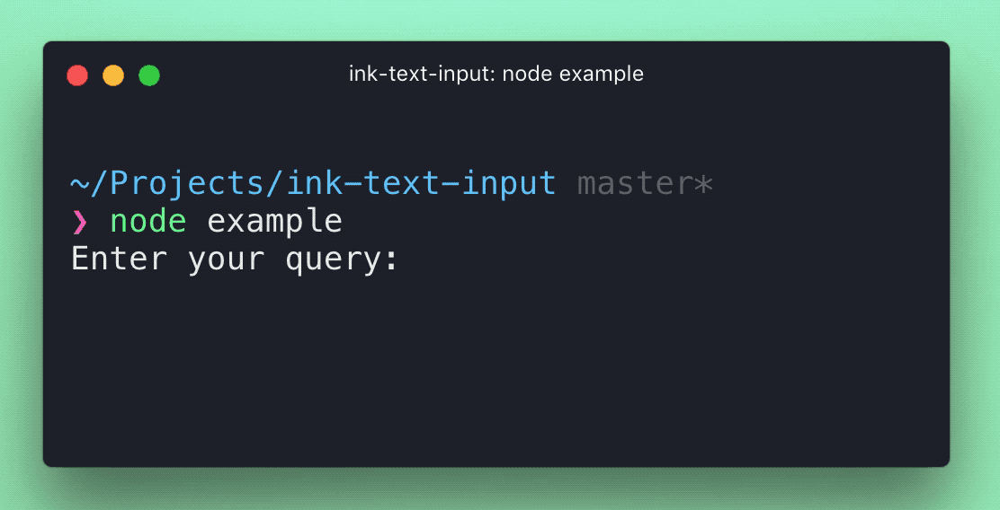

# ink-text-input [](https://travis-ci.org/vadimdemedes/ink-text-input)

> Text input component for [Ink](https://github.com/vadimdemedes/ink).


## Install

```
$ npm install ink-text-input
```


## Usage

```jsx
import React from 'react';
import {render, Box} from 'ink';
import TextInput from 'ink-text-input';

class SearchQuery extends React.Component {
	constructor() {
		super();

		this.state = {
			query: ''
		};

		this.handleChange = this.handleChange.bind(this);
	}

	render() {
		return (
			<Box>
				<Box marginRight={1}>
					Enter your query:
				</Box>

				<TextInput
					value={this.state.query}
					onChange={this.handleChange}
				/>
			</Box>
		);
	}

	handleChange(query) {
		this.setState({query});
	}
}

render(<SearchQuery/>);
```




## Props

### value

Type: `string`

Value to display in a text input.

### placeholder

Type: `string`

Text to display when `value` is empty.

### showCursor

Type: `boolean`<br>
Default: `true`

Whether to show cursor and allow navigation inside text input with arrow keys.

### highlightPastedText

Type: `boolean`<br>
Default: `false`

Highlight pasted text.

### mask

Type: `string`

Replace all chars and mask the value. Useful for password inputs.

```jsx
<TextInput
	value="Hello"
	mask="*"
/>
//=> "*****"
```

### onChange

Type: `Function`

Function to call when value updates.

### onSubmit

Type: `Function`

Function to call when `Enter` is pressed, where first argument is a value of the input.

## Uncontrolled usage

This component also exposes an [uncontrolled](https://reactjs.org/docs/uncontrolled-components.html) version, which handles `value` changes for you. To receive the final input value, use `onSubmit` prop.

```jsx
import React from 'react';
import {render, Box} from 'ink';
import {UncontrolledTextInput} from 'ink-text-input';

const SearchQuery = () => {
	const handleSubmit = query => {
		// Do something with query
	};
	
	return (
		<Box>
			<Box marginRight={1}>
				Enter your query:
			</Box>

			<UncontrolledTextInput onSubmit={handleSubmit}/>
		</Box>
	);
};

render(<SearchQuery/>);
```

## License

MIT © [Vadim Demedes](https://github.com/vadimdemedes)
